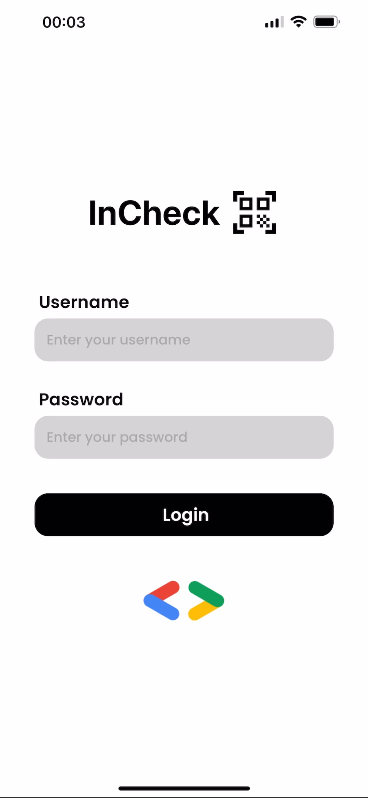
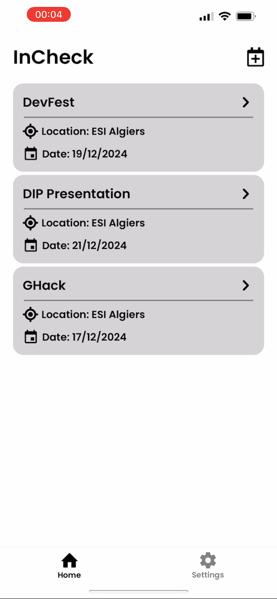
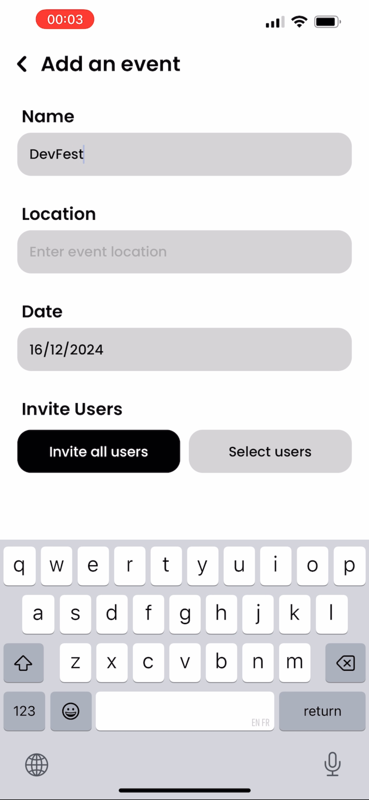
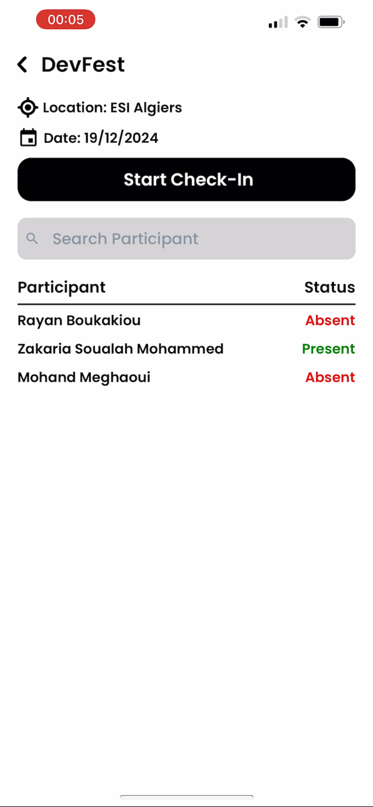

## Overview

This is a repository for a mobile application to streamline attendance management for events built with React Native on an Expo template.

## Features

- **Authentication**: Securely log in and register with username and password.
- **View Events**: Browse all events in an organized list
- **Event Details and Participants**: View detailed information about events, including name, location and date. Check the list of participants attending each event.
- **Add Event**: Create new events with ease by providing event details like name, location and date.

## Backend Repository

You can check the backend part of this project via this link: [Backend](https://github.com/BoukaRayan/InCheck-Backend)

## Download

You can download the game and try it out using this link: [Download](https://bit.ly/incheck-app)

## Screenshots

<div style="display: flex; flex-wrap: wrap; justify-content: space-around;">
  
  
  
  
</div>

## Video

https://github.com/user-attachments/assets/c7ee39d7-a214-474e-bb88-bf205adbeda8

## Installation

### ⚠️ Prerequisites

- [Node.js](https://nodejs.org/)
- [Yarn](https://yarnpkg.com/) (optional, but recommended)

### Clone the Repository

```bash
git clone https://github.com/soualahmohammedzakaria/InCheck-App.git
cd InCheck-App
```

### Install Dependencies

```
yarn install
# or
npm install
```

## Contributing

Contributions are welcome! Please fork the repository and submit a pull request with your changes. Ensure your code follows the project's coding standards and includes appropriate tests.

## License

This project is licensed under the MIT License. See the [LICENSE](LICENSE) file for details.
